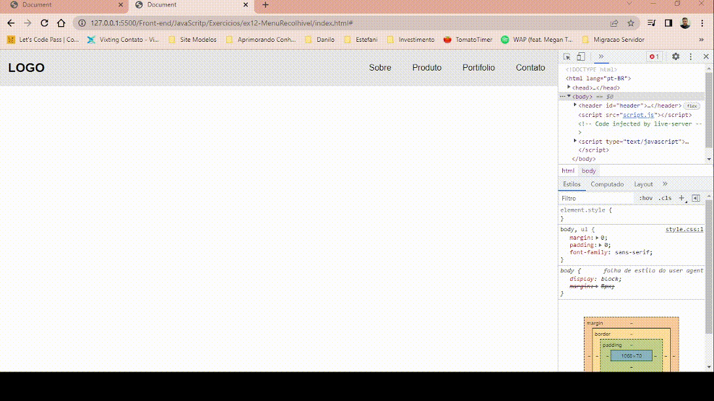

 Projeto de Menu Hamburguer responsivo

<h1 align="center"> 
Menu Hamburguer
</h1>

# Tabela de Conteúdos

<!--ts-->
   * [Features](#Features)
   * [Exemplo do site](#Exemplo-do-site-em-funcionamento)
   * [Tecnologias](#Tecnologias-Utilizadas)
   * [Autor](#autor)

<!--te-->

# Features

- [x] Inicialização do projeto
- [x] Criação de páginas html
- [x] Estilizando o CSS
- [x] Animação com JavaScript
- [x] Estilização menu hamburguer
- [x] Publicação no git.io

# Exemplo do site em funcionamento

<a href="https://daniloaugusto9101.github.io/menuHamburguer/" title="Danilo" target="_blank">

Site demo clique aqui

</a>

# Tecnologias Utilizadas

As seguintes ferramentas e linguagens foram usadas na construção do projeto:

- [HTML](https://developer.mozilla.org/pt-BR/docs/Web/HTML)
- [CSS](https://developer.mozilla.org/pt-BR/docs/Web/CSS)
- [Javascript](https://developer.mozilla.org/pt-BR/docs/Web/JavaScript)
- [VSCode](https://code.visualstudio.com/)

# Autor

<a href="https://www.linkedin.com/in/daniloaugusto9101">
 
  
 <b>Danilo Augusto</b></a> <a href="https://www.linkedin.com/in/daniloaugusto9101" title="Danilo" target="_blank">🚀</a>

Feito por Danilo Augusto 👋🏽 Entre em contato!

